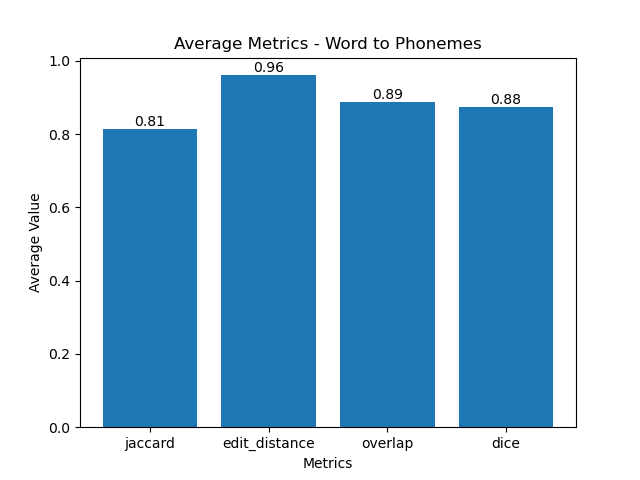
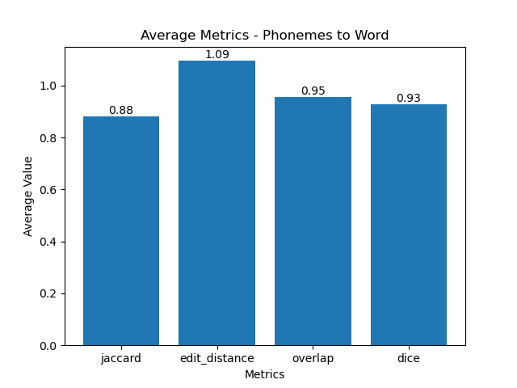

# Natural Word Generator

This program uses seq2seq models to generate natural sounding words based on pronunciation.

This is a tool born out of the sheer frustration of spending hours on character creation screens because I can't think of a good username. Use these words so you don't have to be xX_Gamer42_Xx.

## Requirements

Make sure you have the following prerequisites installed:

- [PyTorch](https://pytorch.org/)
- [NLTK library](https://www.nltk.org/)

Install them using the following commands:

```bash
pip install torch
pip install nltk
```

## Installation

```bash
git clone https://github.com/yourusername/yourproject.git
cd NaturalWordGen
python main.py
```

## Usage

Upon launching the program, you'll encounter an intuitive interface that prompts you to generate unique words. Here's a snapshot of what to expect:

```
***
Press Enter to generate. Type "exit" to exit. Type a number greater than 3 to change the number of phonetics.
***
notta (N AO0 T AA0)
ftsman (F T S M AH0 N)
shaucroff (SH AO1 K R AO2 F)
herzfel (HH ER1 Z F EH0 L)
ufind (Y UW1 F AY2 N D)
audounpe (AO1 D AW2 N P EY1)
```

## How it Works

The Natural Word Generator employs the cmudict dataset from the nltk library for its functionality:

1. **Markov Chain Corpus:** Create a Markov chain corpus based on the phonemes in cmudict. This process generates likely phoneme sequences, ensuring the produced words are pronounceable.

2. **Phonemes to Word Model:** The Phonemes to Word model converts the generated phoneme sequences into approximate word spellings.

3. Tada you have a "word"

## Metrics

- **Edit Distance:** This metric quantifies the similarity between two strings by measuring the minimum number of single-character edits (insertions, deletions, or substitutions) required to transform one string into the other. A lower edit distance indicates a higher similarity.

- **Dice Coefficient:** The Dice Coefficient, also known as the Sørensen–Dice coefficient, gauges the similarity between two sets. The coefficient ranges from 0 to 1, where 0 indicates no similarity, and 1 denotes identical sets.

- **Jaccard Similarity:** Similar to the Dice Coefficient, the Jaccard Similarity measures the similarity between sets but using a slightly different formula. It calculates the size of the intersection divided by the size of the union of the sets.

- **Overlap Coefficient:** The Overlap Coefficient is a ratio of the size of the intersection of two sets to the size of the smaller set. A higher overlap coefficient suggests a greater degree of similarity.




# Citations

Acknowledgments to the nltk library, with credit to:

Bird, Steven, Edward Loper, and Ewan Klein (2009), _Natural Language Processing with Python_. O’Reilly Media Inc.
